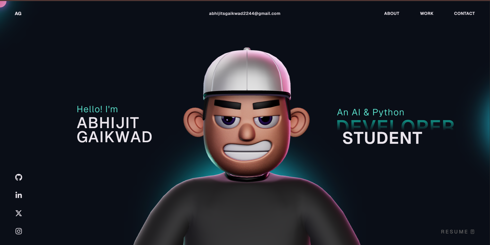

# 🚀 Abhijit Gaikwad | AI & Python Developer Portfolio

Welcome to the repository of my personal portfolio website. This is a high-performance, visually stunning 3D portfolio designed to showcase my journey as an AI & Python Developer, highlighting my projects, skills, and experience.



## 🌐 Live Demo
Check out the live site here: **[the-abhi-dev.netlify.app](https://the-abhi-dev.netlify.app/)**

---

## 🛠️ Tech Stack

This project is built using modern web technologies to ensure smoothness and high-quality visuals:

- **Core**: [React.js](https://reactjs.org/) + [TypeScript](https://www.typescriptlang.org/)
- **Bundler**: [Vite](https://vitejs.dev/)
- **3D Graphics**: [Three.js](https://threejs.org/) & [React Three Fiber](https://docs.pmnd.rs/react-three-fiber)
- **Animations**: [GSAP](https://gsap.com/) (GreenSock Animation Platform)
- **Styling**: Vanilla CSS & [Tailwind CSS](https://tailwindcss.com/)
- **Physics**: [@react-three/rapier](https://github.com/pmndrs/react-three-rapier)
- **Deployment**: [Netlify](https://www.netlify.com/)
- **Analytics**: [Google Analytics 4](https://analytics.google.com/)

---

## ✨ Key Features

- **Interactive 3D Avatar**: A custom-loaded, interactive 3D character that responds to mouse and touch movement.
- **Scroll Animations**: Smooth parallax effects and element transitions using GSAP ScrollTrigger.
- **Physics-based Tech Stack**: A 3D "falling logos" section where tech icons collide and interact using physics engines.
- **Project Carousel**: A premium, blended project showcase with hover effects and direct links to live applications.
- **Responsive Design**: Fully optimized for Desktop, Tablet, and Mobile devices.
- **Visitor Tracking**: Integrated with Google Analytics to monitor reach and engagement.

---

## 🚀 Getting Started Locally

To run this project on your local machine, follow these steps:

1. **Clone the repository:**
   ```bash
   git clone https://github.com/abhijitgaikwad22/Abhi-portfolio.git
   ```

2. **Navigate to the directory:**
   ```bash
   cd Abhi-portfolio
   ```

3. **Install dependencies:**
   ```bash
   npm install
   ```

4. **Start the development server:**
   ```bash
   npm run dev
   ```

5. **Build for production:**
   ```bash
   npm run build
   ```

---

## 📬 Connect with Me

- **LinkedIn**: [Abhijit Gaikwad](https://www.linkedin.com/in/abhijit-gaikwad-881b94268/)
- **GitHub**: [@abhijitgaikwad22](https://github.com/abhijitgaikwad22/)
- **Twitter/X**: [@GaikwadAbhijit_](https://x.com/GaikwadAbhijit_/)
- **Instagram**: [@sanatani_abhijit_gaikwad_1](https://www.instagram.com/sanatani_abhijit_gaikwad_1)

---

## 📄 License

This project is open-source and available under the **MIT License**. Feel free to use it as inspiration for your own work!

---
*Built with ❤️ by Abhijit Gaikwad*
